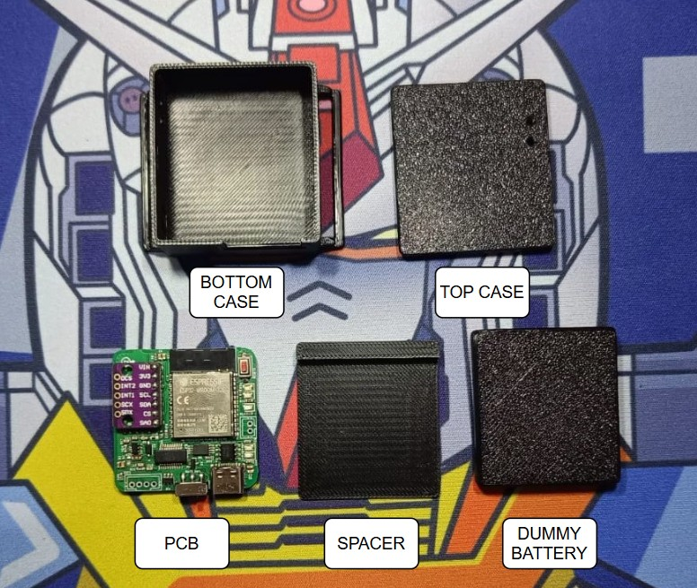
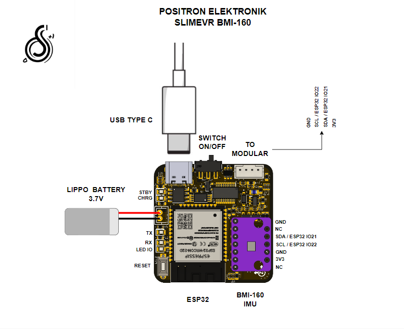
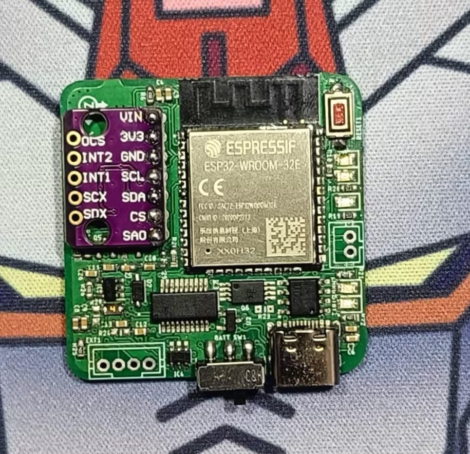
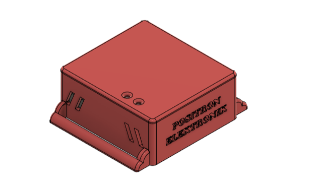
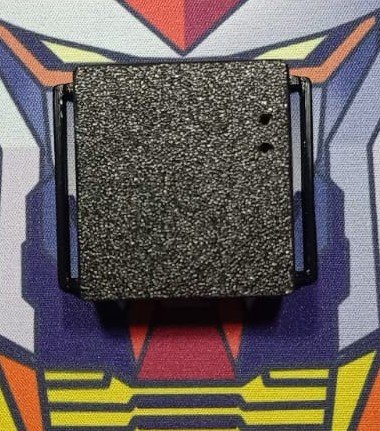
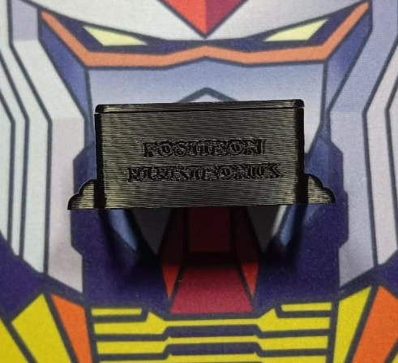

# SlimeVR-BMI160 DIY Tracker

Repositori ini berisi semua file yang dibutuhkan untuk membuat hardware DIY (Do It Yourself) untuk [SlimeVR](https://www.slimevr.dev/), sebuah sistem _full-body tracking_ open-source untuk VR.

Project ini, oleh [Positron Electronik](https://www.tokopedia.com/positronelectronic?source=universe&st=product), merupakan modifikasi dari desain SlimeVR original. Perbedaan utamanya adalah penggunaan sensor IMU **BMI160** yang lebih terjangkau dibandingkan BNO085, serta penggunaan mikrokontroler **ESP32** yang sudah dilengkapi WiFi dan Bluetooth.

  

## Fitur Unggulan
- **Mikrokontroler**: ESP32 WROOM
- **Konektivitas**: WiFi & Bluetooth Low Energy
- **Sensor IMU**: BMI-160 (dengan header, sehingga mudah diganti)
- **Manajemen Daya**:
    - Input daya via USB-C atau baterai LiPo 1s.
    - Sirkuit charger baterai (TP4056) dengan proteksi (DW01A).
- **Konektor Eksternal**: Port I2C tambahan untuk ekspansi.
- **Indikator LED**: Terdapat 5 buah LED dengan fungsi sebagai berikut:
    - **LED 1 (Biru)**: Indikator pengisian daya (menyala saat baterai sedang diisi).
    - **LED 2 (Merah)**: Indikator baterai penuh (menyala saat pengisian selesai).
    - **LED 3 (Merah)**: Indikator ACK, berkedip saat tracker menerima konfirmasi (acknowledgment) bahwa slimevr sedang running.
    - **LED 4 & 5 (Merah/Biru)**: Indikator Serial (TX/RX), akan menyala atau berkedip saat proses flashing firmware.
- **Tombol & Saklar**: Tombol Reset dan Saklar On/Off.

---

## Panduan Penggunaan dan Konfigurasi

### 1. Isi Paket (Untuk Produk Jadi)
- 1x Unit Tracker SlimeVR-BMI160
- 1x Baterai LiPo (sudah terpasang)
- 1x Tali Pengikat Elastis (Strap)

### 2. Pengisian Daya
Sebelum penggunaan, isi daya tracker menggunakan kabel USB-C.
- Lampu **biru** akan menyala saat pengisian berlangsung.
- Lampu **merah** akan menyala jika baterai sudah penuh.

### 3. Konfigurasi Wi-Fi (PENTING!)
Tracker ini **tidak memiliki portal web** untuk pengaturan Wi-Fi. Nama (SSID) dan password Wi-Fi Anda harus dimasukkan langsung ke dalam kode firmware (`hardcode`) sebelum di-upload (flash) ke tracker.

Ini berarti, jika Anda ingin menghubungkan tracker ke jaringan Wi-Fi baru, Anda **wajib melakukan proses flashing ulang.**

Untuk panduan lengkap mengenai cara instalasi software, memasukkan detail Wi-Fi, dan melakukan flashing, silakan ikuti panduan terperinci di bawah ini.

### **➡️ [Klik di sini untuk Panduan Flashing Lengkap](./FIRMWARE/README.md)**

### 4. Pemecahan Masalah Umum
- **Tracker tidak muncul di server SlimeVR.**
    - **Penyebab paling umum:** Pastikan Anda telah memasukkan SSID dan Password Wi-Fi **dengan benar** di dalam file konfigurasi (`platformio.ini`) sebelum melakukan flashing, sesuai dengan panduan di atas.
    - Pastikan PC dan tracker berada di jaringan Wi-Fi yang sama.
    - Pastikan saklar tracker sudah dalam posisi ON dan baterai terisi.
    - Coba restart tracker dan aplikasi SlimeVR Server di PC Anda.

- **Lampu LED tidak menyala sama sekali.**
    - Pastikan saklar sudah di posisi ON.
    - Sambungkan tracker ke charger USB-C untuk memastikan baterai tidak habis total. Jika lampu charger menyala, biarkan terisi daya selama beberapa saat sebelum mencoba lagi.

---

## Untuk Pengembang (DIY)

Bagian ini ditujukan untuk Anda yang ingin merakit atau memodifikasi tracker dari awal.

## Isi Repositori
Berikut adalah penjelasan singkat mengenai isi dari setiap direktori utama:
- **`/PCB`**: Berisi file desain PCB (skematik dan layout) dalam format Eagle serta file produksi (Gerber) yang siap dikirim ke pabrikan PCB.
- **`/HARDWARE`**: Berisi file CAD dan model 3D untuk case/casing tracker, termasuk file `.stl` yang siap untuk di-print 3D.
- **`/FIRMWARE`**: Berisi source code firmware untuk ESP32 (berbasis PlatformIO) dan file `.bin` yang sudah dicompile. **Panduan flashing ada di sini.**
- **`/DOC`**: Berisi dokumentasi pendukung seperti gambar, diagram pinout, Bill of Materials (BOM), dan datasheet.

---

## Langkah-Langkah Memulai

Untuk membangun tracker Anda sendiri, berikut adalah langkah-langkah utamanya:

### 1. Rakit Hardware
Anda perlu membuat PCB dan menyolder semua komponen.
- **File PCB**: Gunakan file Gerber dari direktori **[`/PCB/CAD-CAM`](./PCB/CAD-CAM)**.
- **Daftar Komponen (BOM)**: Daftar lengkap komponen yang dibutuhkan ada di **[`/DOC/BOM_SlimeVRDiyModular.csv`](./DOC/BOM_SlimeVRDiyModular.csv)**.
- **Case 3D Print**: File untuk mencetak case tersedia di direktori **[`/HARDWARE/case`](./HARDWARE/case)**.

### 2. Flash Firmware
Setelah hardware siap, langkah selanjutnya adalah memasang firmware ke ESP32.

### **➡️ [Klik di sini untuk Panduan Flashing Lengkap](./FIRMWARE/README.md)**

Panduan tersebut mencakup semua langkah yang diperlukan, mulai dari instalasi VS Code & PlatformIO, konfigurasi WiFi, hingga proses flashing dan verifikasi melalui serial monitor.

---

<strong>Tampilkan Detail Teknis dan Galeri Hardware</strong>

### Spesifikasi Teknis

| Fitur               | Komponen Digunakan   |
| ------------------- | -------------------- |
| Microcontroller     | ESP32-WROOM-32       |
| Sensor IMU          | BMI-160              |
| IC USB to Serial    | FTDI FT231XS         |
| IC Charger Baterai  | TP4056               |
| IC Proteksi Baterai | DW01A & FS8205A      |
| Regulator Utama     | M3406 (3.3V 800mA)   |

### Diagram Pinout

  

### Dimensi Board
- [PDF Dimensi Board](https://github.com/juarendra/SlimeVR-BMI160/blob/main/HARDWARE/dimension_SlimeVR.pdf)

### Galeri

  
  
  
  

## FAQ
_(Bagian ini dapat diisi dengan pertanyaan yang sering muncul di kemudian hari)._
